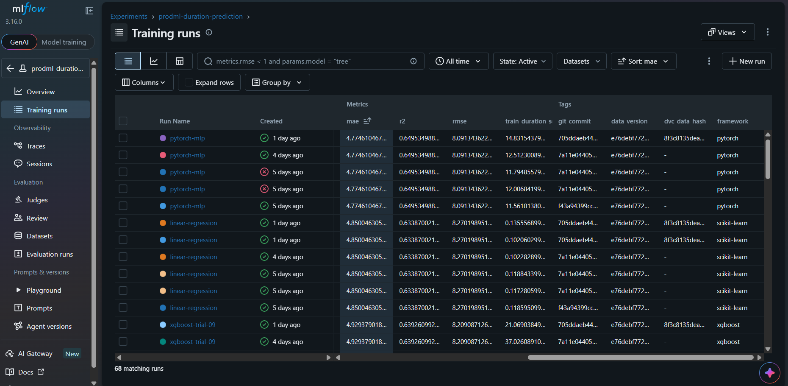

# Module 2 — Reproducible ML Training and Automated Model Promotion

## Overview

Module 2 implements a reproducible and auditable machine-learning training workflow using:

- MLflow experiment tracking
- PostgreSQL as the MLflow backend store
- MinIO as the MLflow artifact store
- MLflow Model Registry
- DVC dataset and pipeline versioning
- Automated quality checks with GitHub Actions

The workflow supports:

1. Pulling and versioning data
2. Preparing and featurizing the data
3. Training multiple model families
4. Tracking experiments and artifacts
5. Comparing candidate models
6. Registering models
7. Promoting only better candidates
8. Reproducing training through DVC
9. Running automated CI quality checks

---

## 1. MLflow Tracking Infrastructure

The local MLflow infrastructure consists of:

- MLflow Tracking Server
- PostgreSQL backend store
- MinIO object storage for artifacts

The MLflow Tracking Server is available locally at:

`http://localhost:5000`

The MinIO console is available locally at:

`http://localhost:9001`

The MLflow experiment used for this module is:

`prodml-duration-prediction`

The application obtains the tracking URI from the environment:

`PRODML_MLFLOW_TRACKING_URI=http://localhost:5000`

MLflow artifact serving is enabled so that logged artifacts can be accessed through the tracking server.

---

## 2. Dataset and Reproducibility

The January 2026 green taxi dataset was used for the main MLflow experiment comparison.

Prepared dataset:

- Rows: 38,308
- Training samples: 30,646
- Validation samples: 7,662
- Features after vectorization: 4,910

The same train/validation split was used for all three model families.

Split configuration:

- Test size: `0.2`
- Random state: `42`

Dataset SHA-256:

`e76debf772c22040b62092892625c680ba39c15a6f05128601cba8fe7cd35313`

DVC dataset hash:

`8f3c8135deab5b8444b3c1d6a6900081`

The experiment runs were generated from the training code at commit:

`705ddaeb44961b097eefe2655c73fae5452a7699`

The later final Module 2 repository state is represented by commit:

`e3946b901dd69ef616abd646a801f5b95dbcbe09`

Author:

`MahmoudOsama20`

This distinction preserves the actual provenance of the MLflow runs while identifying the final repository state.

---

## 3. Model Families

Three model families were evaluated using the same dataset split.

### 3.1 Linear Regression

A scikit-learn `LinearRegression` model was trained as the baseline.

Results:

- MAE: `4.850`
- RMSE: `8.270`
- R²: `0.634`

### 3.2 XGBoost

XGBoost was evaluated through a hyperparameter sweep containing 10 trials.

Each trial was recorded as a nested MLflow run under the XGBoost parent run.

MLflow XGBoost autologging was enabled.

The best XGBoost trial was Trial 9.

Results:

- MAE: `4.929`
- RMSE: `8.209`
- R²: `0.639`

### 3.3 PyTorch MLP

A small feed-forward neural network was trained using PyTorch.

Architecture:

`Input → 64 units → 32 units → Output`

Training configuration:

- Optimizer: Adam
- Learning rate: `0.001`
- Loss: Mean Squared Error
- Epochs: `20`
- Batch size: `256`

Training uses CUDA when an available GPU is detected.

Results:

- MAE: `4.775`
- RMSE: `8.091`
- R²: `0.650`

---

## 4. Experiment Comparison

| Model | MAE | RMSE | R² |
|---|---:|---:|---:|
| Linear Regression | 4.850 | 8.270 | 0.634 |
| Best XGBoost Trial 9 | 4.929 | 8.209 | 0.639 |
| PyTorch MLP | **4.775** | **8.091** | **0.650** |

The PyTorch MLP achieved the strongest validation performance and was selected as the candidate model for registration.

---

## 5. MLflow Run Metadata

Each training run records reproducibility metadata.

Important tags include:

- `git_commit`
- `data_version`
- `dvc_data_hash`
- `author`
- `framework`

The runs also contain:

- Model hyperparameters
- Validation metrics
- Training duration
- Model size
- Model artifacts
- Requirements

Example metadata from the successful Module 2 runs:

- `git_commit`: `705ddaeb44961b097eefe2655c73fae5452a7699`
- `data_version`: `e76debf772c22040b62092892625c680ba39c15a6f05128601cba8fe7cd35313`
- `dvc_data_hash`: `8f3c8135deab5b8444b3c1d6a6900081`
- `author`: `MahmoudOsama20`

---

## 6. MLflow Experiment Comparison Screenshot

The MLflow Training Runs view was used to compare the model families and inspect reproducibility metadata.

The comparison view shows:

- MAE
- RMSE
- R²
- Training duration
- Git commit
- Dataset version
- DVC data hash
- Framework



The view also shows the XGBoost sweep structure and registered model versions.

---

## 7. Logged Artifacts

The training workflow logs artifacts associated with each experiment.

Artifacts include:

- Trained model artifacts
- Residual plots
- Feature-importance plots
- Exact Python package requirements

The XGBoost sweep contains artifacts for the individual trials.

The MLP run also contains its trained model and evaluation plots.

---

## 8. MLflow Model Registry

The selected model was registered under:

`ride-duration-predictor`

The registry lifecycle was tested through:

`None → Staging → Production`

A registered model version was promoted to Production and used for stage-based inference.

The application loads the Production model through the MLflow Model Registry rather than hard-coding a model version.

Production model URI:

`models:/ride-duration-predictor/Production`

The registry workflow also supports rejecting a candidate model when its evaluation metric is worse than the current Production model.

---

## 9. Stage-Based Prediction

Prediction is performed using the model currently assigned to the `Production` stage.

This allows the Production model to be changed through the Model Registry without changing prediction code or rebuilding the application.

The registry lifecycle was verified by switching Production between registered model versions and observing different predictions from the same prediction interface.

This demonstrates that model promotion can change inference behavior without modifying or rebuilding the prediction code.

---

## 10. Conditional Model Promotion

The module implements `promote_if_better()`.

The promotion logic compares the candidate model against the current Production model.

For metrics where lower is better, such as MAE and RMSE, the candidate must improve the metric.

For metrics where higher is better, such as R², the candidate must achieve a higher value.

The workflow was tested for:

- Better candidate → promoted
- Worse candidate → rejected
- Missing candidate metric
- Missing Production model
- Missing Production metric
- R² comparison

This prevents an inferior candidate from automatically replacing the Production model.

---

## 11. DVC Dataset Versioning

DVC was used to version the green taxi datasets.

The January dataset was tracked with DVC and has the data hash:

`8f3c8135deab5b8444b3c1d6a6900081`

The February dataset was also added to DVC.

DVC therefore provides versioned dataset references independent of the Git source-code history.

---

## 12. DVC Reproducible Pipeline

The DVC pipeline is defined at the repository root in `dvc.yaml`.

The pipeline consists of:

`prepare → featurize → train → evaluate`

### Prepare

Loads and prepares the raw green taxi dataset.

Output:

`pipelines/data/prepared.csv`

### Featurize

Transforms the prepared data into model-ready features.

Output:

`pipelines/data/features.pkl`

### Train

Trains the configured XGBoost model using `params.yaml`.

Output:

`pipelines/models/model.pkl`

### Evaluate

Evaluates the trained model.

Output:

`pipelines/metrics.json`

---

## 13. DVC Parameter Reproducibility

The baseline training configuration uses:

```yaml
data:
  test_size: 0.2
  random_state: 42

training:
  n_estimators: 150
  max_depth: 4
  learning_rate: 0.05
```

Changing the number of estimators from `150` to `200` caused the downstream training and evaluation stages to rerun.

The resulting metrics changed from:

| Metric | Baseline | Modified |
|---|---:|---:|
| MAE | 4.883324 | 4.875019 |
| RMSE | 8.171477 | 8.162877 |
| R² | 0.634598 | 0.635366 |

`dvc metrics diff` confirmed the changes.

After restoring the original parameters, `dvc repro` correctly skipped unchanged stages and reran only the affected downstream stages.

The final DVC pipeline was verified as up to date.

---

## 14. DVC and MLflow Integration

The DVC dataset hash is propagated into MLflow runs through the:

`dvc_data_hash`

tag.

This connects:

`Dataset version → DVC → MLflow experiment → trained model`

Together with the Git commit and dataset SHA-256 metadata, this provides traceability from a model back to its source code and data version.

---

## 15. CI Quality Gate

GitHub Actions CI was added under:

`.github/workflows/ci.yml`

The workflow runs on:

- Pull requests
- Pushes to `main`

The quality job performs:

1. Checkout
2. Python 3.12 setup
3. pip dependency caching
4. Dependency installation
5. Ruff linting
6. Black formatting verification

The test job runs after the quality job and executes the Module 2 test suite with coverage reporting.

---

## 16. Automated Test Results

The dedicated Module 2 test suite contains:

**38 tests**

Latest result:

`38 passed`

Coverage:

**82.11%**

Required project coverage threshold:

**70%**

Therefore, the Module 2 test suite passes the required quality gate.

Key coverage results include:

| Module | Coverage |
|---|---:|
| `training.py` | 100% |
| `dvc_pipeline.py` | 93% |
| `registry.py` | 97% |
| `export.py` | 89% |
| `train.py` | 88% |
| Overall | **82.11%** |

Ruff and Black also pass successfully on the repository.

---

## 17. Module 2 Acceptance Checklist

- [x] MLflow Tracking Server configured
- [x] PostgreSQL backend configured
- [x] MinIO artifact storage configured
- [x] Linear Regression experiment
- [x] XGBoost experiment
- [x] 10 XGBoost sweep trials
- [x] PyTorch MLP experiment
- [x] Same train/validation split
- [x] Model hyperparameters logged
- [x] MAE logged
- [x] RMSE logged
- [x] R² logged
- [x] Training duration logged
- [x] Model size logged
- [x] Git commit metadata logged
- [x] Dataset version metadata logged
- [x] DVC data hash logged
- [x] Author metadata logged
- [x] Framework metadata logged
- [x] Model artifacts logged
- [x] Requirements artifact logged
- [x] MLflow experiment comparison completed
- [x] MLflow comparison screenshot captured
- [x] Model registered in MLflow Model Registry
- [x] Production model stage tested
- [x] Stage-based prediction implemented
- [x] Conditional promotion implemented
- [x] Better candidate promotion tested
- [x] Worse candidate rejection tested
- [x] January dataset tracked with DVC
- [x] February dataset tracked with DVC
- [x] DVC prepare stage
- [x] DVC featurize stage
- [x] DVC train stage
- [x] DVC evaluate stage
- [x] DVC parameter-change reproduction tested
- [x] DVC metrics diff verified
- [x] GitHub Actions CI added
- [x] Ruff quality check
- [x] Black quality check
- [x] Automated Module 2 tests
- [x] Coverage requirement satisfied

---

## 18. Conclusion

Module 2 establishes a reproducible and auditable ML training workflow.

MLflow provides experiment tracking, artifact management, and model lifecycle management.

DVC provides dataset and pipeline reproducibility.

GitHub Actions provides an automated quality gate.

The final experiment comparison selected the PyTorch MLP as the strongest candidate based on validation performance:

- MAE = `4.775`
- RMSE = `8.091`
- R² = `0.650`

The combination of Git metadata, dataset hashes, DVC tracking, MLflow runs, model registry stages, and automated tests provides the traceability required for reproducible model development and deployment.
